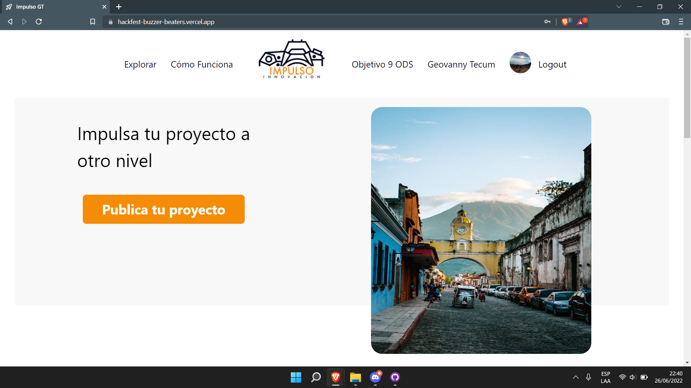

## Tabla de Contenidos
1. [Informacion General 💁‍♂️](#informacion-general)
2. [Tecnologias utilizadas 👨‍💻](#tecnologias)
3. [Instalacion 👨‍🏫](#instalacion)
4. [Como Colaborar 🧑‍🤝‍🧑](#colaborar)
### Informacion General
***
La idea principal del proyecto https://hackfest-buzzer-beaters.vercel.app/ es que jóvenes empresarios guatemaltecos puedan contar con un sitio web para postear sus ideas que les permita tener visibilidad en sus proyectos, esto en base al Objetivo 9 de los ODS. Se buscaría que los visitantes como tu o yo del sitio puedan navegar y descubrir proyectos que les llamen la atención e informarse del objetivo y plan que se tiene en cada uno, y en caso de querer apoyar ya sea intelectualmente o económicamente que puedan disponer de la información de contacto.
### Screenshot

## Tecnologias
***
Las tecnologias implementadas en el proyecto:
* [React ](https://es.reactjs.org/): Version 12.1.6
* [NEXT.js ](https://nextjs.org/): Version 2.34
* [Firebase ](https://firebase.google.com/): Version ^9.8.3
* [Tailwindcss ](https://tailwindcss.com/): Version ^9.8.3
*** 
Deploy Realizado en: 

* [Vercel ](https://vercel.com/):
## Instalacion
***
Para la instalacion del proyecto puedes utilizar los siguiente comandos 
```
$ git clone https://github.com/Alejndro22/hackfest-buzzer-beaters.git
$ cd ../path/to/the/file
$ npm install
$ npm run dev
```
Ahora puede ir  ```localhost:3000``` donde estara la pagina desplegada localmente

## Colaborar
***
Deseas colaborar con el proyecto? Puede contactarnos por este medio
> yowtecum@gmail.com para comunicarte con nuestro CEO.
